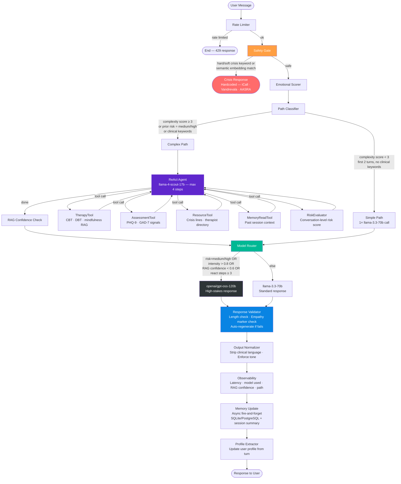

# MHC — Mental Health Companion

> *The friend everyone needs but most people in India never get.*

---

## The Problem

India has **one psychiatrist for every 200,000 people**. The wait to see one is months. The stigma to even admit you need one is enormous. And the people who need help most — college students, young professionals, people navigating family pressure, breakups, career anxiety — aren't going to a clinic. They're going to their phone.

MHC puts a warm, emotionally intelligent companion on that phone. Not a chatbot that says "I'm sorry to hear that." A friend who actually gets it — who speaks Hinglish, who knows what JEE pressure feels like, who understands ghar waale expectations and placement season dread.

---

## What MHC Is

MHC is an **agentic, multi-model mental health companion** built for Indian Gen Z. It speaks the way they speak — Hinglish, casual, like a close friend texting. It validates before it advises. It never dismisses. And when someone is in real danger, it stops everything and connects them to a human.

It is **not** a diagnostic tool. It is **not** a replacement for therapy. It is the first point of contact — the friend who convinces you it's okay to ask for help.

---

## How It Works — The Full Pipeline

Every message a user sends goes through an 11-node LangGraph pipeline. Here's the complete flow:



---

## Node-by-Node Breakdown

### 1. Rate Limiter
**Zero LLM. Deterministic.**

- Token bucket: 10 requests/minute per user
- Backend: Redis (with graceful fail-open — if Redis is down, no user gets blocked)
- Prevents abuse without punishing real users who happen to send fast

---

### 2. Safety Gate
**The most important code in this repo.**

Runs before every other node. No feature flags. No bypasses.

**Layer 1 — Deterministic keyword match**
- Loads `crisis_keywords.json`: `hard_crisis`, `soft_crisis`, `contextual`, `indian_context` categories
- Word-boundary regex — `kamarna` does NOT trigger `marna`
- Negation window: checks 5 words before a keyword match for negation ("nahi marna chahta" is not a crisis)
- `hard_crisis` respects negation. `soft_crisis` does not — we err on the side of caution.

**Layer 2 — Semantic embedding check**
- `all-MiniLM-L6-v2` embeddings
- Cosine similarity against crisis anchor phrases
- Threshold: 0.82 — tuned to catch paraphrased crisis signals that keywords miss ("mere bina sab better off honge")

**On crisis detection:**
- Response is hardcoded. Never LLM-generated. Always includes:
  - iCall: 9152987821
  - Vandrevala Foundation: 1860-2662-345
  - AASRA: 9820466627
- Pipeline ends immediately. No further processing.

**Also handles:**
- Input sanitization (prompt injection protection)
- PII scrubbing (phone numbers, emails stripped before any LLM sees the message)

---

### 3. Emotional Scorer
**Zero LLM. Deterministic. No circular dependency.**

Scores 0.0–1.0 across 4 components, weighted average:

| Component | Weight | How |
|---|---|---|
| Sentiment (TextBlob polarity) | 35% | Absolute value — intensity not valence |
| Hinglish tiered keywords | 35% | high=1.0, medium=0.65, low=0.35; self-referential phrases add 1.3× multiplier |
| Punctuation density | 15% | `!!`, `???`, `...`, ALL CAPS clusters |
| Word repetition | 15% | Repeated words signal rumination |

**Why deterministic?** If the LLM outputs the risk level and we use that to decide which LLM to call — circular dependency. The scorer runs before any model call.

**Output used by:**
- Path Classifier (complexity input)
- Model Router (high intensity → 120B)
- Companion Prompt (adds distress notes to system message)
- Response Validator (high intensity → force empathy regeneration)

---

### 4. Path Classifier
**Decides: 1 LLM call (simple) or 2–3 LLM calls (complex).**

Hard rules that immediately push to complex:
- Prior session risk was `medium` or `high`
- Clinical keywords present (PHQ-9/GAD-7 signals, Indian context: JEE, NEET, shaadi, pagal)
- 2+ topic fragments in message (aur/and/or sentence splitting)
- Session has 3+ prior exchanges

Numeric score for edge cases:
```
complexity = (clinical × 2) + (prior_risk × 2) + emotional_intensity + min(topic_count, 3) + length_factor
→ complex if score ≥ 3
```

**~55% simple, ~45% complex in practice.** Simple path skips ReAct entirely — one 70B call and done.

---

### 5. ReAct Agent *(complex path only)*
**Uses llama-4-scout-17b — cheap, fast, reasoning-capable.**

Max 4 steps. JSON-structured think → act → observe loop.

Available tools (all **zero LLM** — pure retrieval):

| Tool | What it does |
|---|---|
| `TherapyTool` | Semantic RAG over CBT, DBT, mindfulness, breathing techniques |
| `AssessmentTool` | PHQ-9 and GAD-7 signal lookup from knowledge base |
| `ResourceTool` | Indian crisis lines, therapist directories, helplines |
| `MemoryReadTool` | Fetches prior session context for this user |
| `RiskEvaluator` | Scores conversation-level risk from full history |

Schema validation on every tool call. If the model returns bad JSON, one retry before giving up and passing through what we have.

The ReAct agent **never writes the final response**. It only gathers context. The final response is always written by a 70B or 120B model.

---

### 6. RAG Confidence Check
After ReAct finishes, scores average cosine similarity of retrieved chunks.

- Below 0.6 → low confidence → escalate to 120B for final response
- Above 0.6 → standard 70B is fine

Prevents bad retrieval from producing confident-sounding but wrong responses.

---

### 7. Model Router
**Decides which model writes the final response.**

Routes to `openai/gpt-oss-120b` if **any** of:
- Risk level is `medium` or `high`
- Emotional intensity > 0.8
- RAG confidence < 0.6
- ReAct needed 3+ steps (complex situation)

Otherwise uses `llama-3.3-70b-versatile`.

**Fallback chain if primary fails:**
`120B → 70B → llama-4-scout-17b → hardcoded template`

The template always includes crisis helplines. The pipeline never returns an empty response.

---

### 8. Response Validator
Checks the LLM output before it reaches the user:

- **Length check:** minimum 80 characters — prevents one-line dismissals
- **Empathy marker check:** must contain at least one of: `samajh`, `feel`, `lagta`, `dard`, `mushkil`, `sath`, `akele nahi`, `sunna`, etc.

If either check fails → regenerates using the same model with `force_empathy=True` injected into the prompt. One retry only.

---

### 9. Output Normalizer
Strips clinical language that would feel cold or robotic in a companion context. Enforces the Hinglish tone that the companion prompt established.

---

### 10. Observability
Logs per-request metrics without blocking the response:
- Total latency (ms)
- Model actually used (may differ from selected if fallback triggered)
- Path taken (simple/complex)
- RAG confidence score
- ReAct steps used
- Whether safety triggered, rate limited, referral needed

---

### 11. Memory Update + Profile Extractor
**Fire-and-forget — never blocks the response.**

Two async background tasks:
1. **Write to DB:** saves turn (message, response, emotions, risk, clinical flags, metrics) to SQLite/PostgreSQL
2. **Summarize:** every 10 exchanges, generates a session summary using the fast model — carried forward as context into future turns

**Profile Extractor** updates a persistent user profile from this turn — used in subsequent requests to give Mahi context ("this person is a 2nd year engineering student dealing with placement anxiety").

---

## The Companion — Mahi

Mahi is the persona. Defined entirely in `app/prompts/companion_prompt.py`.

**Personality:**
- Grew up between Delhi and Bangalore. Gets Indian family pressure, board exam stress, career anxiety.
- Speaks Hinglish — naturally, not forced. "matlab", "sach mein", "bas", "ugh, woh feeling"
- Never starts consecutive responses the same way. Never starts with "yaar" as a rote opener.
- Short responses. 3 sentences max before the question. Like texting.

**Hard rules:**
1. Validate the feeling first — always, specifically, using their exact words
2. One question at the end. Never two. Never zero.
3. No advice unless explicitly asked
4. Never add people the user didn't mention
5. "nahi pata kya karunga" → sit with the uncertainty first, don't jump to options

**Output format:** Always JSON — `response`, `emotions`, `risk_level`, `clinical_flags`, `referral_needed`. The pipeline parses this, not the user.

---

## LLM Cost Architecture

| Scenario | LLM calls | Models used |
|---|---|---|
| Crisis detected | 0 | None — hardcoded response |
| Simple message, early conversation | 1 | llama-3.3-70b |
| Complex message, high emotion | 2–3 | llama-4-scout (ReAct) + gpt-oss-120b (response) |
| Weighted average | ~1.5 | — |

**The expensive model only runs when it matters.** Cheap models handle structure and reasoning. Expensive models handle humans.

---

## Tech Stack

| Layer | Technology | Why |
|---|---|---|
| Orchestration | LangGraph | Stateful graph, conditional routing, async |
| Fast/ReAct LLM | llama-4-scout-17b (Groq) | Cheap reasoning, fast inference |
| Quality LLM | llama-3.3-70b-versatile (Groq) | Standard responses, good Hinglish |
| High-stakes LLM | openai/gpt-oss-120b (Groq) | Crisis/complex turns only |
| Embeddings | all-MiniLM-L6-v2 | Safety semantic check + RAG |
| Vector DB | ChromaDB | Local-first, zero infra |
| Session DB | SQLite → PostgreSQL | Zero setup locally, swap one env var |
| Cache / Rate limit | Redis | Fail-open by design |
| API | FastAPI + uvicorn | Async throughout |
| UI | Streamlit | Rapid iteration |
| Logging | structlog | Structured JSON logs, per-request context |

---

## Safety Design Principles

1. **Safety gate is unconditional.** It runs first. Always. No flags, no A/B tests, no exceptions.
2. **Crisis responses are never LLM-generated.** An LLM hallucinating a wrong phone number could cost a life.
3. **Fail open on infrastructure, fail closed on safety.** Redis down → rate limiter passes. Safety detector erroring → conservatively flag as unsafe.
4. **Hinglish-aware crisis detection.** English-only keyword lists miss "mere bina sab theek rahenge", "khatam kar loon", "sab chhod dun". We cover them.
5. **Negation-aware matching.** "marna nahi chahta" is not a crisis. Word-boundary + 5-word negation window prevents false positives.

**Before any real users: have a mental health professional fluent in Indian linguistic context review the safety layer.**

---

## Project Structure

```
app/
├── graph/
│   ├── builder.py          LangGraph graph definition + routing logic
│   ├── state.py            MHCState TypedDict — the full pipeline state
│   └── nodes/
│       ├── rate_limiter.py
│       ├── safety_gate.py
│       ├── emotional_scorer.py
│       ├── path_classifier.py
│       ├── react_agent.py
│       ├── rag_confidence.py
│       ├── model_router.py
│       ├── direct_responder.py
│       ├── response_validator.py
│       ├── output_normalizer.py
│       ├── observability.py
│       ├── memory_update.py
│       └── profile_extractor.py
│
├── tools/                  ReAct tools — ALL zero LLM, pure retrieval
│   ├── therapy_tool.py
│   ├── assessment_tool.py
│   ├── resource_tool.py
│   ├── memory_read_tool.py
│   └── risk_evaluator.py
│
├── safety/
│   ├── crisis_detector.py      Keyword + negation matching
│   ├── semantic_safety.py      Embedding-based crisis detection
│   ├── pii_scrubber.py
│   ├── input_sanitizer.py
│   └── crisis_keywords.json    Hindi · Hinglish · English · Indian context
│
├── rag/                    ChromaDB embedder, retriever, confidence scorer, ingest
├── knowledge/              JSON knowledge bases (therapy, assessment, crisis, resources)
├── prompts/                companion_prompt, react_prompt, summary_prompt
├── services/               LLMService (Groq + fallback chain), SessionService, Redis
├── config.py               Pydantic Settings — all thresholds, model names, URLs
└── main.py                 FastAPI app

tests/
├── test_safety/            Crisis detection, false positive regression
├── test_rag/
├── test_graph/             Rate limiter, emotional scorer, path classifier, model router
└── test_api/

run_crisis_test.py          20-turn end-to-end crisis arc simulation
streamlit_app.py            Chat UI
```

---

## Quickstart

```bash
git clone https://github.com/SanyamWadhwa07/mhc-agentic
cd mhc-agentic

python -m venv venv
source venv/Scripts/activate    # Windows
# source venv/bin/activate      # Mac/Linux

pip install -e .

cp .env.example .env
# Add GROQ_API_KEY

# Ingest knowledge base into ChromaDB
python -m app.rag.ingest

# Start API
uvicorn app.main:app --reload

# Start UI (separate terminal)
streamlit run streamlit_app.py
```

Run the crisis simulation:
```bash
python run_crisis_test.py
```

---

## API

```
POST /chat
Body:   { "message": str, "user_id": str?, "session_id": str? }
Returns: {
    "response": str,
    "emotions": [str],
    "risk_level": "low" | "medium" | "high",
    "clinical_flags": [str],
    "referral_needed": bool,
    "session_id": str,
    "metrics": { latency_ms, model_used, path, rag_confidence, react_steps, ... }
}

GET /health
Returns: { "status": "ok", "version": "4.0.0" }
```

---

*MHC is not a replacement for professional mental health care. It is the friend who helps you take the first step toward it.*
